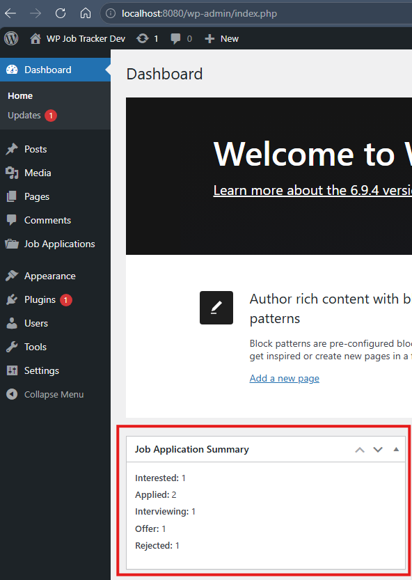
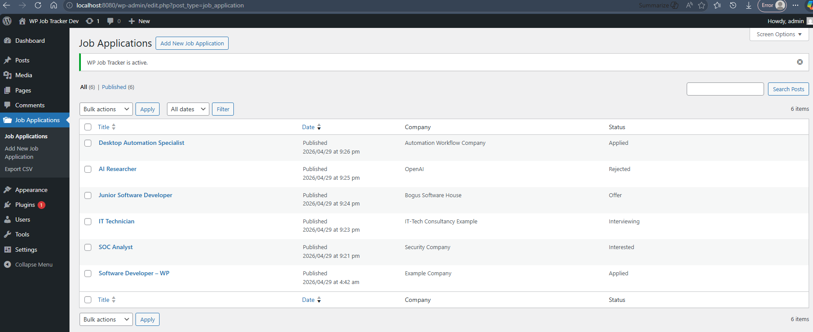
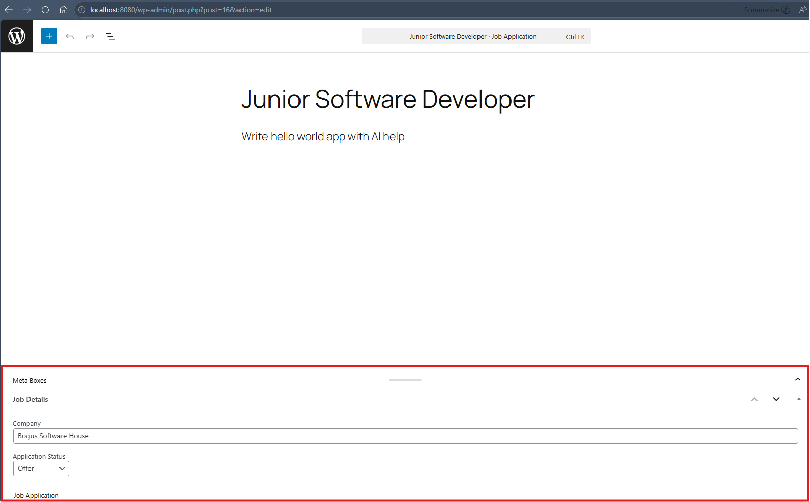
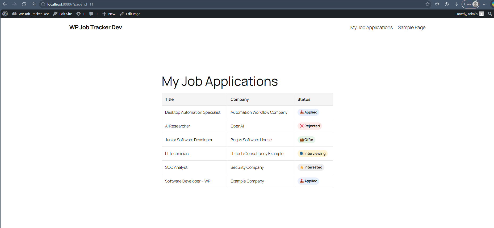

# WordPress Job Application Tracker Plugin

A custom WordPress plugin built with PHP that allows users to track job applications using structured data. The plugin demonstrates core WordPress development concepts including custom post types, meta fields, admin UI extensions, shortcode rendering, and data export functionality.

## Features
- Custom Post Type for job applications
- Meta boxes for structured fields (Company, Status)
- Admin list table customization
- Dashboard widget with status summary
- Frontend shortcode display
- CSV export functionality
- Lightweight frontend styling with status badges

## Screenshots

### Dashboard Widget (Admin)

### Job Applications List (Admin Table)

### Edit Screen with Meta Box

### Frontend Page (Shortcode Output)


## Tech Stack
- PHP
- WordPress
- MySQL
- Docker (WordPress + MySQL)

## Local Development

### Environment Variables

This project uses a `.env` file for local development configuration.

Create a `.env` file in the project root based on the example below or copy and modify provided `.env.example`:

```env
WORDPRESS_DB_NAME=wordpress
WORDPRESS_DB_USER=wordpress
WORDPRESS_DB_PASSWORD=wordpress
MYSQL_ROOT_PASSWORD=root
WORDPRESS_PORT=8080
```

### Setup
```bash
docker compose up -d
```

Visit:
http://localhost:8080

### Teardown
```bash
docker compose down
```
or 
```bash
docker compose down -v
```
to completely wipe data

## Project Structure
```
plugin/
  includes/
  admin/
  public/
```

## Author

George Louie Conde  
Software Developer  
Calgary, AB  
[LinkedIn](https://linkedin.com/in/glconde)  
[GitHub](https://github.com/glconde)

## License & Version
This project is licensed under the MIT License.
See the LICENSE file for details.

### Version
0.1.0